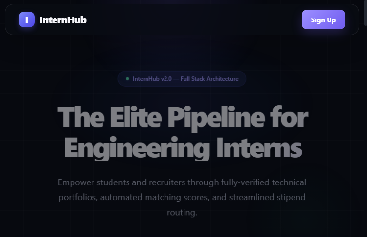
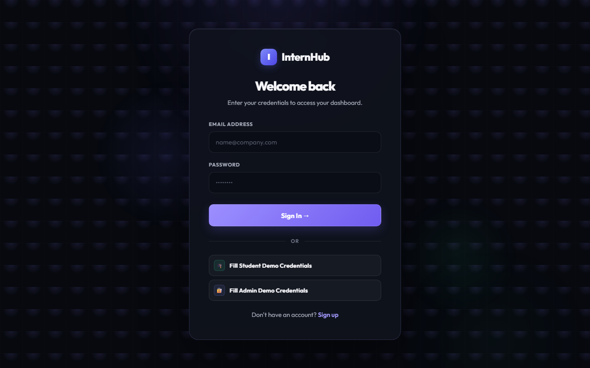
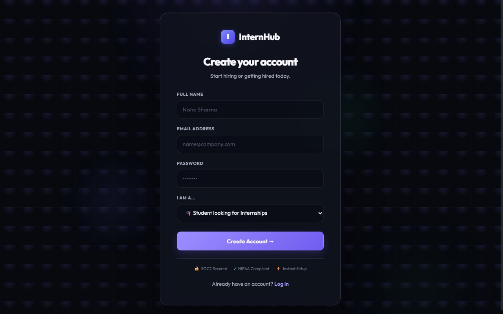
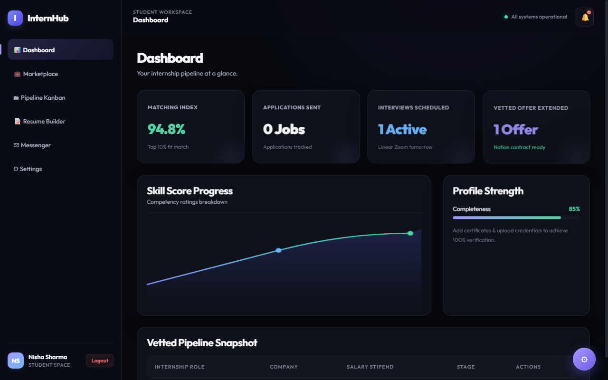
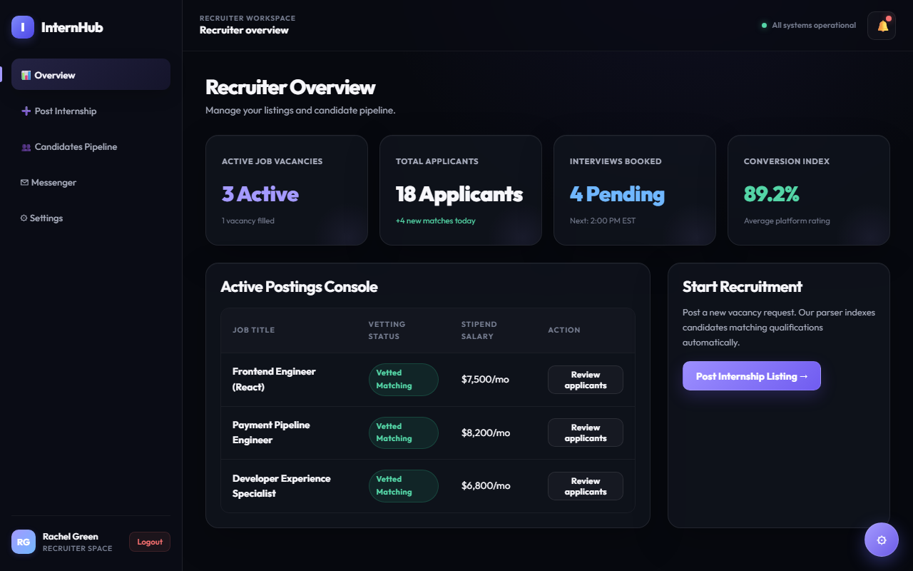
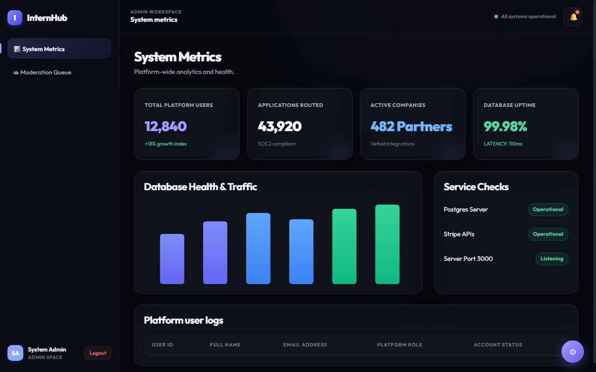

# InternHub — Premium Internship Management Platform (Frontend UI)

InternHub is a state-of-the-art internship management portal designed to seamlessly bridge the gap between top university developers and hyper-growth startups. The platform features fully-vetted technical portfolios, automated matching indices, and streamlined application workflows.

---

## 📸 Interface Screenshots

### Landing Page


### Authentication Views
| Login Page | Register Page |
|:---:|:---:|
|  |  |

### Workspace Dashboards
| Student Dashboard | Recruiter Dashboard |
|:---:|:---:|
|  |  |

| Admin System Dashboard |
|:---:|
|  |

---

## 🚀 Core Features

- **Floating Navigation Header**: Premium sticky navigation header with dynamic theme switching and client-side viewport options.
- **Dynamic Showcase Hero**: Interactive visual presentation featuring animated gradient typography and live growth metrics.
- **Integrated Partners Ticker**: Displays verified enterprise client logos (Linear, Stripe, Vercel, Notion, Figma).
- **Interactive Bento Grid Features**:
  - **Vetted Matching Score**: Algorithms display candidate skill levels (e.g. 98th percentile).
  - **Resume Simulator**: Interactive Notion-style resume formatting engine with live visual previews.
  - **Pipeline Kanban**: Real-time drag-and-drop simulation that tracks applications through stages (Applied, Reviewing, Interviewing, Offered, Archived).
  - **Secure Messaging**: Live simulated threaded chat between candidates and recruiters.
  - **Role-Based Access**: Specialized views for Student, Recruiter, and Admin workspaces.
- **Statistics & Growth Modules**: Visual metrics detailing active listings, escrowed stipends, and average hire times.
- **Interactive Contact Form**: Validation-ready contact form for queries.

---

## 🛠️ Technology Stack

- **Structure**: HTML5 (Semantic page layouts)
- **Styling**: Vanilla CSS (CSS Custom Properties/design tokens, dark/light modes, flexible responsive layouts, premium glassmorphism patterns)
- **Logic**: Pure Vanilla JavaScript (Client-side role switching, mock database states, active route handlers, drag-and-drop Kanban simulation, live resume compilers)

---

## 💻 How to Run the Frontend

You can run and preview the frontend using either of the following methods:

### Method 1: Static Preview (Frontend Only)
Since this is a client-side HTML/CSS/JS application, you can run it directly:
1. **Direct Browser Execution**: Double-click `index.html` to open it in your browser.
2. **Local Dev Server (Recommended)**:
   * Serve it using `npx` (requires Node.js):
     ```bash
     npx serve
     ```
   * Or use Python:
     ```bash
     python -m http.server 8000
     ```
   * Or use VS Code's **Live Server** extension.

### Method 2: Full-Stack Integration (With Backend Sync)
To hook the frontend up with the active backend APIs, PostgreSQL database, and live authentication:
1. Ensure you have the database set up:
   * Create a PostgreSQL database.
   * Run the schema file: `database/schema.sql`.
2. Configure environment variables:
   * Copy the `.env.example` in the root directory to `.env`.
   * Update the database connection credentials (`DB_USER`, `DB_HOST`, `DB_NAME`, `DB_PASSWORD`, `DB_PORT`).
3. Install dependencies in the root project directory:
   ```bash
     npm install
     ```
4. Start the backend server:
   ```bash
     npm start
     ```
5. Open your browser and navigate to:
   ```
   http://localhost:3000
   ```
